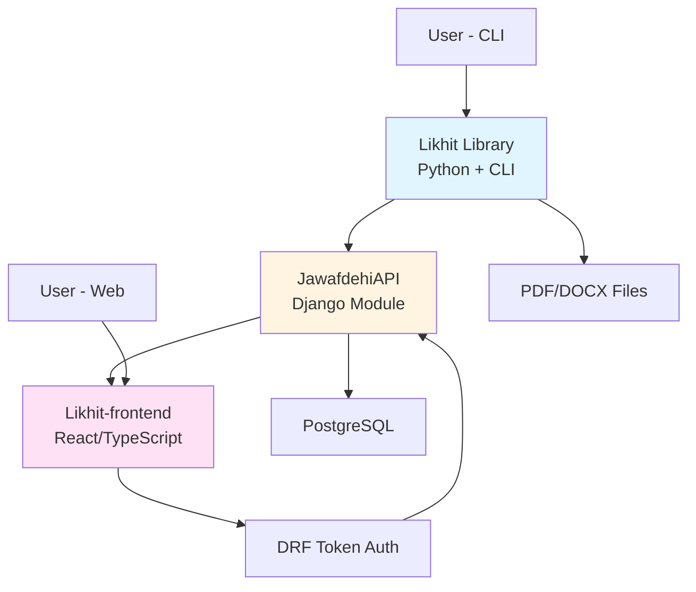
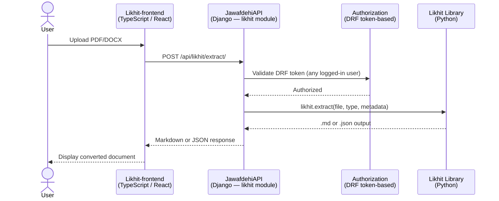

# Design Document: Likhit Document Converter

## Overview

Likhit (लिखित, meaning "written" or "documented") is a tool for converting Nepali official documents—PDFs and scanned publications—into structured Markdown files. The system provides both a web interface and command-line interface, making it accessible to non-technical contributors and developers alike. The goal is to transform content from CIAA press releases, Kanun Patrika issues, court rulings, and similar publications into machine-readable, indexable formats for downstream platforms like Jawafdehi and NGM.

The architecture consists of three independent services: a standalone Python library with CLI (Likhit), a Django REST API integration (JawafdehiAPI), and a React/TypeScript web frontend (Likhit-frontend). The design emphasizes minimal dependencies in the core library, extensible output formats, and seamless integration with the existing Jawafdehi ecosystem.

## Architecture

### System Components



### Service Architecture



### Technology Stack

**Likhit Library (Python):**
- Language: Python 3.12+
- Package Manager: Poetry
- PDF Processing: Pluggable extraction strategies per document type
- Testing: pytest with samples/ directory for integration tests
- CI/CD: GitHub Actions

**JawafdehiAPI Integration (Django):**
- Framework: Django 5.2+ with Django REST Framework
- Authentication: DRF token-based (any logged-in user)
- Database: PostgreSQL
- Package Manager: Poetry

**Likhit-frontend (React/TypeScript):**
- Language: TypeScript
- Framework: React
- Build Tool: Vite
- Runtime: Bun
- Testing: Vitest
- Deployment: Cloudflare Pages (static site)

### Design Principles

1. **Thin Core Library**: Likhit library must minimize dependencies to avoid conflicts when imported by JawafdehiAPI
2. **Optional Heavy Dependencies**: Advanced features should be extras, not hard requirements
3. **Pluggable Extraction Strategies**: Each document type can specify its own extraction strategy
4. **Extensible Output Formats**: New output types (plain text, HTML) can be added without changing extraction pipeline
5. **Service Independence**: Each service operates independently with clear interfaces
6. **Test-Driven Development**: Comprehensive unit and integration tests with real-world samples

## Components and Interfaces

### Likhit Library (Python)

#### Core Extraction Module

**Purpose**: Handles document parsing and text extraction from PDFs and DOCX files

**Interface**:
```python
def extract(
    file_path: str,
    doc_type: DocumentType,
    metadata: Optional[Dict[str, Any]] = None,
    pages: Optional[str] = None,
    extract_table: Optional[int] = None
) -> ExtractionResult:
    """
    Extract text and structure from a document.
    
    Args:
        file_path: Path to input PDF or DOCX file
        doc_type: Type of document (CIAA_PRESS_RELEASE, KANUN_PATRIKA, etc.)
        metadata: Optional metadata to include in output (title, date, source_url, etc.)
        pages: Optional page range (e.g., "1-3" or "5")
        extract_table: Optional table index to extract (0-based)
    
    Returns:
        ExtractionResult containing structured document data
    """
```

**Responsibilities**:
- Text extraction from PDFs using document-type-specific strategies
- Structure recognition (headings, paragraphs, lists, tables)
- Metadata extraction and validation
- Page range filtering
- Table extraction

#### Document Type Registry

**Purpose**: Manages document type definitions and type-specific extraction rules

**Interface**:
```python
class DocumentType(Enum):
    CIAA_PRESS_RELEASE = "ciaa-press-release"
    KANUN_PATRIKA = "kanun-patrika"
    SUPREME_COURT_ORDER = "supreme-court-order"
    # more to come

class DocumentTypeHandler:
    def get_extraction_strategy(self) -> ExtractionStrategy:
        """Return the extraction strategy for this document type"""
    
    def detect_structure(self, raw_text: str) -> DocumentStructure:
        """Detect document structure based on type-specific patterns"""
    
    def extract_metadata(self, raw_text: str) -> Dict[str, Any]:
        """Extract type-specific metadata from document"""
    
    def validate(self, structure: DocumentStructure) -> bool:
        """Validate extracted structure meets type requirements"""
```

**Responsibilities**:
- Define document type schemas
- Select appropriate extraction strategy per document type
- Implement type-specific extraction logic
- Validate extracted content
- Provide extensibility for new document types

#### Extraction Strategies

**Purpose**: Provide pluggable text extraction strategies for different document types

**Interface**:
```python
class ExtractionStrategy(ABC):
    @abstractmethod
    def extract_text(self, file_path: str, pages: Optional[str] = None) -> str:
        """Extract raw text from document"""
    
    @abstractmethod
    def extract_tables(self, file_path: str) -> List[Table]:
        """Extract tables from document"""

class FontBasedStrategy(ExtractionStrategy):
    """Font-based extraction for typeset PDFs with proper text encoding"""
    def extract_text(self, file_path: str, pages: Optional[str] = None) -> str:
        # Use PDF library for font-based extraction
        pass
```

**Responsibilities**:
- Implement text extraction approaches
- Handle document-specific extraction requirements
- Support extensibility for new extraction methods

#### Output Renderers

**Purpose**: Convert extracted document structure to various output formats

**Interface**:
```python
class OutputRenderer(ABC):
    @abstractmethod
    def render(self, result: ExtractionResult) -> str:
        """Render extraction result to output format"""

class MarkdownRenderer(OutputRenderer):
    def render(self, result: ExtractionResult) -> str:
        """Render as Markdown with YAML frontmatter"""

class JSONRenderer(OutputRenderer):
    def render(self, result: ExtractionResult) -> str:
        """Render as structured JSON"""
```

**Responsibilities**:
- Format conversion (Markdown, JSON)
- YAML frontmatter generation
- Extensibility for new output formats

#### CLI Interface

**Purpose**: Provide command-line access to extraction functionality

**Interface**:
```bash
likhit extract [OPTIONS] INPUT --out OUTPUT

Options:
  --type TEXT              Document type (required)
  --out TEXT              Output file path (required)
  --title TEXT            Override document title
  --date TEXT             Publication date (YYYY-MM-DD)
  --source-url TEXT       Original URL of document
  --pages TEXT            Page range (e.g., "1-3" or "5")
  --extract-table INTEGER Table index to extract (0-based)
```

**Responsibilities**:
- Parse command-line arguments
- Validate input parameters
- Invoke extraction pipeline
- Write output to file

### JawafdehiAPI Integration (Django Module)

#### Likhit Django Module

**Purpose**: Wrap Likhit library functionality as a Django REST API endpoint

**Interface**:
```python
# views.py
class LikhitExtractView(APIView):
    permission_classes = [IsAuthenticated]
    
    def post(self, request):
        """
        Extract text from uploaded document.
        
        Request Body:
            - file: Uploaded PDF/DOCX file
            - doc_type: Document type string
            - metadata: Optional metadata dict
            - pages: Optional page range
            - extract_table: Optional table index
            - output_format: "markdown" or "json"
        
        Response:
            - content: Extracted text in requested format
            - metadata: Extracted metadata
            - likhit_version: Version of Likhit library used
        """
```

**Responsibilities**:
- Handle file uploads
- Validate authentication (any logged-in user)
- Invoke Likhit library
- Return formatted response
- Handle errors gracefully

#### API Serializers

**Purpose**: Validate and serialize API requests and responses

**Interface**:
```python
class LikhitExtractRequestSerializer(serializers.Serializer):
    file = serializers.FileField()
    doc_type = serializers.ChoiceField(choices=DocumentType.choices())
    metadata = serializers.JSONField(required=False)
    pages = serializers.CharField(required=False)
    extract_table = serializers.IntegerField(required=False)
    output_format = serializers.ChoiceField(choices=["markdown", "json"], default="markdown")

class LikhitExtractResponseSerializer(serializers.Serializer):
    content = serializers.CharField()
    metadata = serializers.JSONField()
    likhit_version = serializers.CharField()
```

**Responsibilities**:
- Validate request parameters
- Serialize response data
- Provide clear error messages

### Likhit-frontend (React/TypeScript)

#### Document Upload Component

**Purpose**: Allow users to upload documents for conversion

**Interface**:
```typescript
interface DocumentUploadProps {
  onUploadComplete: (result: ExtractionResult) => void;
  onError: (error: Error) => void;
}

const DocumentUpload: React.FC<DocumentUploadProps> = ({
  onUploadComplete,
  onError
}) => {
  // File upload, document type selection, metadata input
}
```

**Responsibilities**:
- File selection and validation
- Document type selection
- Optional metadata input
- Progress indication
- Error handling

#### Conversion Preview Component

**Purpose**: Display converted document with preview and download options

**Interface**:
```typescript
interface ConversionPreviewProps {
  content: string;
  format: "markdown" | "json";
  metadata: Record<string, any>;
}

const ConversionPreview: React.FC<ConversionPreviewProps> = ({
  content,
  format,
  metadata
}) => {
  // Render preview, provide download
}
```

**Responsibilities**:
- Render Markdown preview
- Display JSON structure
- Provide download functionality
- Allow users to copy/save converted content

#### API Client

**Purpose**: Handle communication with JawafdehiAPI

**Interface**:
```typescript
class LikhitAPIClient {
  async extract(
    file: File,
    docType: DocumentType,
    options?: ExtractionOptions
  ): Promise<ExtractionResult> {
    // POST to /api/likhit/extract/
  }
}
```

**Responsibilities**:
- HTTP request handling
- Authentication token management
- Error handling and retry logic
- Response parsing

## Data Models

### ExtractionResult

```python
@dataclass
class ExtractionResult:
    """Result of document extraction"""
    title: str
    doc_type: DocumentType
    source_url: Optional[str]
    publication_date: Optional[date]
    likhit_version: str
    sections: List[Section]
    tables: List[Table]
    metadata: Dict[str, Any]
```

### Section

```python
@dataclass
class Section:
    """Document section with heading and content"""
    heading: Optional[str]
    body: str
    level: int  # Heading level (1-6)
    subsections: List[Section]
```

### Table

```python
@dataclass
class Table:
    """Extracted table data"""
    headers: List[str]
    rows: List[List[str]]
    caption: Optional[str]
    index: int  # Table index in document
```

### DocumentStructure

```python
@dataclass
class DocumentStructure:
    """Intermediate representation of document structure"""
    raw_text: str
    pages: List[Page]
    fonts: Dict[str, FontInfo]
    layout_elements: List[LayoutElement]
```

## Correctness Properties

Property 1: Valid document types are accepted
*For any* extraction request with a valid DocumentType, the system should successfully process the document without type validation errors
**Validates: Core extraction functionality**

Property 2: Invalid document types are rejected
*For any* extraction request with an invalid document type string, the system should return a validation error before attempting extraction
**Validates: Input validation**

Property 3: Extracted metadata includes required fields
*For any* successful extraction, the output should include title, doc_type, likhit_version, and publication_date (if available)
**Validates: Metadata completeness**

Property 4: Page range filtering works correctly
*For any* extraction request with pages="1-3", only content from pages 1, 2, and 3 should be included in the output
**Validates: Page filtering**

Property 5: Table extraction returns valid JSON
*For any* extraction request with extract_table parameter, the output should be valid JSON with headers and rows arrays
**Validates: Table extraction**

Property 6: Markdown output includes YAML frontmatter
*For any* extraction with output format "markdown", the output should start with "---" and include valid YAML frontmatter
**Validates: Markdown formatting**

Property 7: JSON output is valid and parseable
*For any* extraction with output format "json", the output should be valid JSON that can be parsed without errors
**Validates: JSON formatting**

Property 8: Authentication is required for API access
*For any* API request to /api/likhit/extract/ without a valid authentication token, the system should return HTTP 401
**Validates: Authentication requirement**

Property 9: Authenticated users can extract documents
*For any* logged-in Jawafdehi user with valid token, extraction requests should be processed successfully
**Validates: Authorization**

Property 10: File upload size limits are enforced
*For any* file upload exceeding the configured size limit, the system should return HTTP 413 with appropriate error message
**Validates: Resource protection**

Property 11: Unsupported file types are rejected
*For any* file upload with extension other than .pdf or .docx, the system should return validation error
**Validates: File type validation**

Property 12: CLI and API produce identical output
*For any* document extracted via CLI and API with identical parameters, the output content should be identical
**Validates: Consistency across interfaces**

## Error Handling

### Validation Errors

**Invalid Document Type:**
- Condition: User provides unsupported document type
- Response: HTTP 400 with "Invalid document type. Supported types: ciaa-press-release, kanun-patrika, supreme-court-order, gazette-notice"
- Recovery: User selects valid document type

**Invalid File Format:**
- Condition: User uploads file with unsupported extension
- Response: HTTP 400 with "Unsupported file format. Please upload PDF or DOCX file"
- Recovery: User uploads correct file format

**Invalid Page Range:**
- Condition: User provides malformed page range (e.g., "a-b")
- Response: HTTP 400 with "Invalid page range format. Use format: '1-3' or '5'"
- Recovery: User corrects page range syntax

**File Too Large:**
- Condition: Uploaded file exceeds size limit
- Response: HTTP 413 with "File size exceeds maximum limit of 50MB"
- Recovery: User compresses or splits document

### Extraction Errors

**PDF Parsing Failure:**
- Condition: PDF is corrupted or encrypted
- Response: HTTP 422 with "Unable to parse PDF. File may be corrupted or encrypted"
- Recovery: User provides unencrypted or repaired PDF

**Text Extraction Failure:**
- Condition: PDF uses unsupported font encoding or extraction strategy fails
- Response: HTTP 422 with "Unable to extract text using {strategy}. Document may require alternative extraction method"
- Recovery: System attempts fallback strategy (if configured), or user provides alternative document

**Table Extraction Failure:**
- Condition: Requested table index doesn't exist
- Response: HTTP 404 with "Table index {index} not found. Document contains {count} tables"
- Recovery: User requests valid table index

**Empty Document:**
- Condition: Document contains no extractable text
- Response: HTTP 422 with "No text content found in document"
- Recovery: User verifies document format or provides alternative document

### Authentication Errors

**Missing Token:**
- Condition: API request without authentication token
- Response: HTTP 401 with "Authentication credentials were not provided"
- Recovery: User logs in and includes token

**Invalid Token:**
- Condition: API request with expired or invalid token
- Response: HTTP 401 with "Invalid or expired authentication token"
- Recovery: User refreshes authentication token

### System Errors

**Library Import Error:**
- Condition: JawafdehiAPI cannot import Likhit library
- Response: HTTP 500 with "Document conversion service unavailable"
- Recovery: System administrator checks Likhit installation

**Temporary File Error:**
- Condition: System cannot write temporary files
- Response: HTTP 500 with "Unable to process document. Please try again"
- Recovery: System administrator checks disk space and permissions

## Testing Strategy

### Unit Testing Approach

**Likhit Library (pytest):**
- Test extraction logic with mocked PDF/DOCX inputs
- Test document type handlers independently
- Test output renderers with synthetic ExtractionResult objects
- Test metadata extraction and validation
- Test page range parsing and filtering
- Test table extraction logic

**JawafdehiAPI Module (pytest + Django TestCase):**
- Test API endpoint with mocked Likhit library
- Test authentication and authorization
- Test request validation and serialization
- Test error handling and response formatting
- Test file upload handling

**Likhit-frontend (Vitest):**
- Test component rendering and user interactions
- Test API client with mocked responses
- Test file validation logic
- Test preview rendering
- Test error display and recovery

### Property-Based Testing Approach

**Property Test Library**: Hypothesis (Python), fast-check (TypeScript)

**Test Generators:**
- `valid_document_type()`: Generates valid DocumentType enum values
- `invalid_document_type()`: Generates invalid document type strings
- `page_range()`: Generates valid page range strings
- `metadata_dict()`: Generates valid metadata dictionaries
- `extraction_result()`: Generates valid ExtractionResult objects

**Property Test Examples:**

```python
# Feature: likhit-document-converter, Property 3: Extracted metadata includes required fields
@given(doc_type=valid_document_type(), metadata=metadata_dict())
def test_metadata_completeness(doc_type, metadata):
    result = extract(sample_pdf, doc_type, metadata)
    assert result.title is not None
    assert result.doc_type == doc_type
    assert result.likhit_version is not None

# Feature: likhit-document-converter, Property 6: Markdown output includes YAML frontmatter
@given(result=extraction_result())
def test_markdown_frontmatter(result):
    renderer = MarkdownRenderer()
    output = renderer.render(result)
    assert output.startswith("---\n")
    assert "\n---\n" in output
    # Parse YAML frontmatter
    frontmatter = output.split("---\n")[1]
    parsed = yaml.safe_load(frontmatter)
    assert "title" in parsed
    assert "doc_type" in parsed
```

### Integration Testing Approach

**Samples Directory Structure:**
```
samples/
├── ciaa_press_release_sample.pdf
├── ciaa_press_release_expected.md
├── kanun_patrika_sample.pdf
├── kanun_patrika_expected.md
├── supreme_court_order_sample.pdf
└── supreme_court_order_expected.md
```

**Integration Test Strategy:**
- Run full extraction pipeline against real sample documents
- Compare output against expected fixtures
- Assert metadata extraction accuracy
- Verify table extraction completeness
- Test page range filtering with multi-page samples
- Serve as regression guards for parsing changes

**CI Integration:**
- Run integration tests on every pull request
- Fail build if any sample extraction differs from expected output
- Provide diff output for debugging

### End-to-End Testing

**CLI E2E Tests:**
- Test complete CLI workflows: `likhit extract --type=ciaa-press-release sample.pdf --out output.md`
- Verify output file creation and content
- Test error scenarios (missing file, invalid type)
- Test all CLI flags and options

**API E2E Tests:**
- Test complete API workflows: upload → extract → download
- Test authentication flow
- Test file upload with various sizes
- Test concurrent extraction requests
- Test error responses

**Frontend E2E Tests:**
- Test complete user workflows: login → upload → preview → download
- Test error display and recovery
- Test responsive design on mobile devices

## Performance Considerations

### Extraction Performance

**PDF Processing:**
- Font-based extraction is fast (< 1 second for typical documents)
- Implement timeout for long-running extractions (60 seconds default)
- Document type handlers select appropriate strategy based on document characteristics

**Memory Management:**
- Stream large PDFs instead of loading entirely into memory
- Limit maximum file size to 50MB
- Clean up temporary files after extraction

**Stateless Processing:**
- No database storage of extraction results
- All processing is on-demand
- Results returned immediately in response

### API Performance

**Request Handling:**
- Implement request queuing for concurrent extractions
- Limit concurrent extraction jobs to 5 per server
- Return HTTP 429 if queue is full

**Response Optimization:**
- Compress large responses (gzip)
- Implement pagination for batch extraction endpoints (future)
- Stream large output files instead of buffering

### Frontend Performance

**File Upload:**
- Implement chunked upload for large files
- Show progress indicator during upload
- Enable client-side file validation before upload

**Preview Rendering:**
- Lazy-load large Markdown previews
- Implement virtual scrolling for long documents
- Debounce preview updates during editing

## Security Considerations

### Authentication & Authorization

**API Security:**
- Require DRF token authentication for all extraction endpoints
- Any logged-in Jawafdehi user can extract documents
- No role-based restrictions (all authenticated users have access)

**Token Management:**
- Use secure token generation (Django's default)

### Input Validation

**File Upload Security:**
- Validate file extensions (.pdf, .docx only)
- Verify file MIME types match extensions
- Limit file size to prevent DoS (50MB max)

**Parameter Validation:**
- Sanitize all user-provided metadata
- Validate page ranges to prevent injection
- Limit metadata field sizes
- Escape special characters in output

### Data Protection

**Temporary File Handling:**
- Store uploaded files in secure temporary directory
- Delete temporary files after extraction (max 1 hour retention)
- Use unique random filenames to prevent collisions
- Restrict file permissions (owner read/write only)

**Output Security:**
- Sanitize extracted text to prevent XSS in preview
- Validate JSON output structure
- Escape special characters in Markdown output
- Prevent path traversal in output file paths

### CORS Configuration

**API CORS:**
- Allow requests from Likhit-frontend domain only
- Restrict to POST method for extraction endpoint
- Include credentials in CORS policy
- Set appropriate preflight cache duration

## Dependencies

### Likhit Library Dependencies

**Core Dependencies (minimal):**
- PDF text extraction library (decision pending: `pymupdf` vs `pypdf`/`pdfplumber`)
- `python-docx`: DOCX text extraction
- `pyyaml`: YAML frontmatter generation
- `argparse`: CLI framework (Python standard library)

**Optional Dependencies (extras):**
- `camelot-py`: Advanced table extraction (extra: tables)

**Development Dependencies:**
- `pytest`: Testing framework
- `hypothesis`: Property-based testing
- `black`: Code formatting
- `ruff`: Linting

### JawafdehiAPI Dependencies

**Additional Dependencies:**
- `djangorestframework`: REST API framework
- `likhit`: Likhit library (from PyPI or git)

**Note**: JawafdehiAPI already has Django, PostgreSQL, and authentication dependencies

### Likhit-frontend Dependencies

**Core Dependencies:**
- `react`: UI framework
- `react-router-dom`: Routing
- `axios`: HTTP client
- `react-markdown`: Markdown preview
- `react-dropzone`: File upload

**Development Dependencies:**
- `vite`: Build tool
- `vitest`: Testing framework
- `typescript`: Type checking
- `eslint`: Linting

## Deployment Considerations

### Likhit Library Deployment

**PyPI Package:**
- Publish to PyPI as `likhit`
- Semantic versioning (0.1.0 for MVP)
- Include samples/ directory in package for testing
- Provide clear installation instructions

**GitHub Repository:**
- Repository: `github.com/NewNepal-org/likhit`
- Include comprehensive README with examples
- Provide CONTRIBUTING.md for contributors
- Set up GitHub Actions for CI/CD

### JawafdehiAPI Integration

**Installation:**
- Add `likhit` to `pyproject.toml` dependencies
- Run `poetry install` to install Likhit library

**Configuration:**
- Add `likhit` to `INSTALLED_APPS`
- Configure file upload settings (max size, allowed types)
- Set up URL routing for `/api/likhit/` endpoints

**Environment Variables:**
- `LIKHIT_MAX_FILE_SIZE`: Maximum upload size (default: 50MB)
- `LIKHIT_EXTRACTION_TIMEOUT`: Extraction timeout (default: 60s)

**Note**: No database migrations required - Likhit operates statelessly

### Likhit-frontend Deployment

**Build Configuration:**
- Build with Vite: `bun run build`
- Output to `dist/` directory
- Configure API base URL for production

**Hosting:**
- Deploy to Cloudflare Pages (static site)
- Automatic deployments from git repository
- Global CDN distribution
- Configure CORS for API communication

**Environment Variables:**
- `VITE_API_BASE_URL`: JawafdehiAPI base URL
- `VITE_MAX_FILE_SIZE`: Maximum upload size (must match API)

## MVP Scope

### Open Questions

**PDF Library Selection: pymupdf vs pypdf/pdfplumber**
- **pymupdf (fitz)**: Faster performance, more comprehensive API, better handling of complex PDFs
- **pypdf/pdfplumber**: Pure Python, simpler API, potentially easier to maintain
- **Decision needed**: Which library best balances performance, maintainability, and compatibility with Nepali fonts?
- **Considerations**: 
  - Speed requirements for typical CIAA/Kanun Patrika documents
  - Handling of Devanagari fonts and Unicode
  - Dependency footprint and licensing
  - Table extraction capabilities

### Phase 1: Core Extraction (MVP)

**Document Types:**
1. CIAA press releases (full text extraction)
2. Tables from CIAA annual reports (table extraction via `--extract-table`)
3. Kanun Patrika full text (complete text extraction)

**Features:**
- CLI tool with `extract` subcommand
- Font-based text extraction from PDFs
- Markdown and JSON output formats
- Basic metadata extraction
- Page range filtering
- Single table extraction

**Testing:**
- Unit tests for all core modules
- Integration tests with sample documents
- CI/CD with GitHub Actions

### Phase 2: API Integration

**Features:**
- Django module in JawafdehiAPI
- REST API endpoint: `POST /api/likhit/extract/`
- DRF token authentication
- File upload handling
- Error handling and validation

**Testing:**
- API endpoint tests
- Authentication tests
- File upload tests

### Phase 3: Web Interface

**Features:**
- React/TypeScript frontend
- Document upload component
- Conversion preview
- Download functionality

**Testing:**
- Component tests
- E2E user workflow tests
- Responsive design tests
