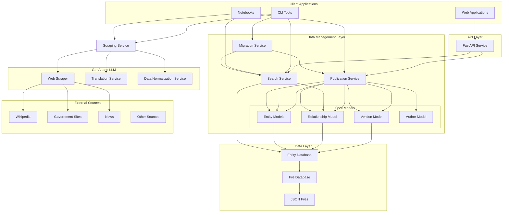

# Design Document

## Overview

The Nepal Entity Service is a comprehensive system for managing Nepali public entities with structured entity management, versioning, relationship tracking, and automated data collection. The architecture follows a service-oriented design with optional components - core models and database, optional API service, and optional scraping capabilities.

## Architecture

### High-Level Architecture



### Component Architecture

**Core Layers:**
1. **Core Models**: Pydantic models (Entity, Relationship, Version, Author)
2. **Database Layer**: File-based JSON storage at `nes-db/v2` with abstract interface
3. **Service Layer**: Publication, Search, Migration, and Scraping services
4. **API Layer**: FastAPI REST service with hosted documentation
5. **Client Layer**: CLI tools, notebooks, and web applications

## Components and Interfaces

### Publication Service

Central orchestration layer for entity lifecycle management with automatic versioning and attribution tracking.

**Responsibilities:**
- Entity CRUD operations (Person, Organization, Location)
- Relationship management with temporal tracking
- Automatic version snapshots on all modifications
- Author attribution and change tracking
- Unified validation and transaction management

**Core Models:**
- **Entity Models**: Base Entity, Person, Organization (PoliticalParty, GovernmentBody), Location
- **Relationship Model**: Typed connections with temporal attributes
- **Version Model**: Change snapshots with attribution
- **Author Model**: Change attribution metadata

#### Service Interface Example

```python
from nes.services import PublicationService
from nes.core.models import Entity, Relationship

# Initialize the publication service
pub_service = PublicationService(database=db)

# Entity operations (returns Entity model instance)
entity = pub_service.create_entity(
    entity_data=entity_dict,
    author_id="author:system:csv-importer",
    change_description="Initial import"
)

# Relationship operations (returns Relationship model instance)
relationship = pub_service.create_relationship(
    source_id="entity:person/ram-chandra-poudel",
    target_id="entity:organization/political_party/nepali-congress",
    relationship_type="MEMBER_OF",
    author_id="author:system:csv-importer"
)

# Version operations (returns list of Version model instances)
versions = pub_service.get_entity_versions(
    entity_id="entity:person/ram-chandra-poudel"
)

# Update operations with automatic versioning
updated_entity = pub_service.update_entity(
    entity=entity,
    author_id="author:system:csv-importer",
    change_description="Updated attributes"
)
```

### Search Service

Read-optimized service for entity and relationship queries with filtering and pagination.

**Capabilities:**
- Text search across entity names (Nepali and English)
- Type/subtype filtering
- Attribute-based filtering
- Relationship queries by type, source, or target
- Pagination support (limit/offset)

**Example Usage:**
```python
search_service.search_entities(
    query="poudel",
    entity_type="person",
    sub_type="politician",
    limit=10
)
```

### Migration Service

Orchestrates database updates through versioned Python scripts with Git-based tracking for deterministic, idempotent execution.

**Key Features:**
- Sequential migration folders (000-name, 001-name, etc.)
- Git commit tracking for applied migrations
- Migration context with service access (Publication, Search, Scraping)
- File reading helpers (CSV, JSON, Excel)
- Batch commits for large migrations (1000+ files)
- CLI commands: list, pending, run, create

**Migration Script Example:**
```python
# migrations/005-add-ministers/migrate.py
async def migrate(context):
    ministers = context.read_csv("ministers.csv")
    
    for row in ministers:
        entity = await context.publication.create_entity(...)
        party = await context.search.find_entity_by_name(row["party"])
        if party:
            await context.publication.create_relationship(...)
    
    context.log(f"Imported {len(ministers)} ministers")
```

**Workflow:**
1. Contributor creates migration → 2. Submits PR → 3. Maintainer reviews/merges → 4. GitHub Actions execute → 5. Changes committed to Database Repository → 6. Submodule updated

### Core Models

**Entity Model**: Slug-based IDs, hierarchical typing (type/subtype), multilingual names, versioning, flexible attributes

**Relationship Model**: Typed connections (AFFILIATED_WITH, MEMBER_OF, etc.), temporal tracking (start/end dates), custom attributes

**Version Model**: Complete state snapshots, author attribution, change descriptions, timestamps

### Database Layer

**EntityDatabase Interface**: Abstract CRUD operations for entities, relationships, versions, and authors

**File Database Implementation**: JSON storage at `nes-db/v2`, organized by type/subtype, atomic operations, caching, indexing

**Data Maintainer Interface**: Local Python API for trusted maintainers, no authentication, automatic versioning, batch operations

### API Service

**REST Endpoints** (under `/api` prefix):
- `/api/entities` - List/filter entities
- `/api/entities/{id}` - Get entity details
- `/api/entities/{id}/versions` - Version history
- `/api/relationships` - Query relationships
- `/api/search` - Text search
- `/api/health` - Health check

**Documentation Hosting**:
- `/` - Markdown-based documentation landing page
- `/{page}` - Documentation pages rendered from `docs/*.md`
- `/docs` - OpenAPI/Swagger schema

**Features**: CORS support, error handling, Pydantic validation, read-only public API

### Scraping Service

Standalone service for extracting and normalizing data from external sources using GenAI/LLM. Returns normalized data without database access.

**Components:**
- **Web Scraper**: Multi-source extraction (Wikipedia, government sites, news)
- **Translation Service**: Nepali ↔ English translation and transliteration
- **Data Normalization**: LLM-powered structuring, relationship discovery, name disambiguation

**Example:**
```python
scraping_service.extract_from_wikipedia("Ram_Chandra_Poudel")
scraping_service.normalize_person_data(raw_data)
scraping_service.translate("राम चन्द्र पौडेल", "ne", "en")
```

### CLI Tools

Built with Python Click for command-line access to services.

**Commands:**
- `nes search entities` - Search and filter entities
- `nes show <id>` - View entity details
- `nes versions <id>` - Version history
- `nes migrate list/pending/run/create` - Migration management
- `nes server start/dev` - API server
- `nes integrity check` - Relationship integrity

### Notebook Applications

Jupyter notebooks for interactive data import and maintenance with human-in-the-loop workflows.

**Typical Workflow:**
1. Scrape data from external source
2. Normalize to entity model
3. Check for duplicates using Search Service
4. Manual review and decision
5. Create or update entity via Publication Service

**Use Cases**: Interactive import, data quality analysis, experimental workflows, bulk operations with oversight

## Data Models

**Entity**: slug, type/subtype, multilingual names (PRIMARY/ALIAS/etc.), identifiers, attributes, contacts, descriptions, version_summary

**Relationship**: source/target entity IDs, type (AFFILIATED_WITH, MEMBER_OF, etc.), temporal dates, attributes, version_summary

**Version**: entity_id, version number, complete snapshot, created_at, author, change_description

**Example Usage:**
```python
pub_service.create_entity(entity_data, author_id, change_description)
pub_service.create_relationship(source_id, target_id, type, author_id)
pub_service.get_entity_versions(entity_id)
```

## Error Handling

**Validation**: Pydantic schema validation, business rules, reference integrity, data quality checks

**API Errors**: 400 (bad request), 404 (not found), 409 (conflict), 422 (unprocessable), 500 (server error)

**Format**: Structured error responses with code, message, and field-level details

## Testing Strategy

**TDD Approach**: Red-Green-Refactor cycle with test-first development

**Test Levels**:
- **Unit**: Model validation, business logic, identifier generation, data transformation
- **Integration**: Database operations, API endpoints, version management, relationship management
- **End-to-End**: Complete workflows, data import, multi-entity scenarios, performance benchmarks

**Test Data**: Authentic Nepali data with proper cultural context, multilingual coverage, edge cases

## Performance Considerations

**Read-Time Priority**: Optimize for sub-100ms API response times; accept slower writes

**Optimizations**:
- **Database**: Read-optimized file structure, aggressive caching, pre-computed indexes, denormalized storage
- **Search**: Query optimization, result caching, efficient pagination
- **API**: HTTP caching with ETags, connection pooling, pre-computed filters

**Scalability**: Read replicas, CDN integration, horizontal scaling, async write processing

## Security Considerations

**Data Protection**: Input validation, safe file operations, path validation

**API Security**: CORS configuration, rate limiting, input size limits, careful error disclosure

**Data Privacy**: PII handling, attribution privacy, data retention policies, future access control


## Migration System

Community-driven data evolution through versioned Python migration scripts with Git-based tracking.

### Two-Repository Architecture

**Service API Repository**: Application code, migration scripts in `migrations/`, lightweight (~10MB)

**Database Repository**: Entity JSON files (100k-1M files), Git submodule at `nes-db/`, large (~1GB+), modified by migrations

**Workflow**: Contributor creates migration → Submits PR → Maintainer reviews/merges → GitHub Actions execute → Changes committed to Database Repository → Submodule updated

**Benefits**: Separation of concerns, lightweight service repo, scalable database repo, code review separate from data, complete audit trail

### Migration Components

**Migration Manager**: Discovers migrations, checks applied status via Git log, validates structure

**Migration Runner**: Executes scripts, manages Git commits/pushes, handles batch commits (1000+ files), provides dry-run mode

**Migration Context**: Provides service access (Publication, Search, Scraping), file readers (CSV/JSON/Excel), logging

**Migration Script Usage**:
```python
async def migrate(context):
    """Migration scripts use services directly."""
    # Read data
    ministers = context.read_csv("ministers.csv")
    
    # Use publication service directly
    author_id = "author:migration:005-add-ministers"
    
    for row in ministers:
        entity = Entity(...)
        
        # Direct service call (no wrapper)
        await context.publication.create_entity(
            entity=entity,
            author_id=author_id,
            change_description="Import minister"
        )
    
    # Use search service directly
    existing = await context.search.find_entity_by_name("Ram Sharma")
    
    # Use scraping service directly
    normalized = await context.scraping.normalize_name("राम शर्मा")
    
    context.log(f"Imported {len(ministers)} ministers")
```

### Migration Structure

**Folder Format**: `migrations/NNN-descriptive-name/` with `migrate.py` (required), `README.md` (required), data files (optional)

**Models**: Migration (prefix, name, paths, metadata), MigrationResult (status, stats, logs, commit SHA), MigrationStatus enum

### Determinism and Tracking

**Git-Based Tracking**: Applied migrations tracked via Git commits in Database Repository (no separate tracking table)

**Linear Model**: Sequential execution (000, 001, 002...), no forking/merging, forward-only (no rollback)

**Idempotency**: Check Git log before execution, skip if already applied, safe to re-run `nes migrate run --all`

**Batch Commits**: Automatically batch commits for 1000+ file changes to avoid performance issues

### CI/CD Workflows

**Migration Preview** (on PR): Execute in isolated environment, generate statistics, post PR comment

**Migration Persistence** (on merge/schedule): Execute pending migrations, commit to Database Repository, update submodule

### Contributor Process

1. Fork Service API Repository
2. Run `nes migrate create <name>`
3. Add data files and implement `migrate.py`
4. Document in `README.md`
5. Submit PR (no database access needed)
