# [Draft] Jawafdehi: A New Force in Nepal's Civic Accountability Infrastructure

*A briefing document for journalists, civil society organizations, and civic partners*

## The Accountability Crisis

Nepal faces a fundamental accountability challenge. The country's [Corruption Perception Index](https://www.transparency.org/en/countries/nepal) remains persistently high, reflecting widespread public belief that corruption pervades all levels of governance—from local ward offices to the highest echelons of political power.

In September 2025, this frustration erupted into nationwide Gen-Z protests. Young Nepalis took to the streets demanding an end to the culture of impunity that has shielded senior political leaders from consequences for decades. The protests were sparked not by a single scandal, but by the accumulated weight of unanswered allegations: leaders implicated in corruption cases who continue to hold power, investigations that stall indefinitely, and accountability organs that appear captured by the very forces they are meant to check.

More critically, the politicization of Nepal's accountability institutions -- the Commission for the Investigation of Abuse of Authority (CIAA), the Central Investigation Bureau (CIB), and the courts -- has systematically eroded the country's accountability infrastructure. These organs, designed to be independent watchdogs, have too often become instruments of political convenience.

The Gen-Z mandate was clear: end the culture of unaccountability. Yet Nepal remains weak in accountability fundamentals—citizen literacy, digitization, transparency, and institutional independence. Even as new political forces emphasize good governance, ending this culture requires two parallel tracks: strengthening government accountability organs and building civic accountability infrastructure. Elections alone will not fulfill the Gen-Z mandate—sustained work on both fronts is essential. Jawafdehi aims to contribute to the civic side by consolidating corruption documentation and coordinating across the diverse teams working toward accountability.

## The Civic Accountability Infrastructure

```mermaid
%%{init: {'themeVariables': {'fontSize': '13px'}, 'flowchart': {'htmlLabels': true, 'curve': 'basis', 'nodeSpacing': 50, 'rankSpacing': 50}}}%%
graph TB
    subgraph Ecosystem["Nepal's Accountability Ecosystem"]
        Gov["🏛️ Government Organs<br/>CIAA • CIB • Courts<br/>Prosecutors • Regulatory Bodies"]
        
        Civic["🤝 Civil Society Groups<br/>NGOs • Advocacy Organizations<br/>Watchdog Groups"]
        
        Ext["🌍 External Organizations<br/>UN Bodies • Donor Nations<br/>International Transparency Organizations"]
        
        Gov <-->|"Accountability Demands"| Civic
        Civic <-->|"Funding & Capacity"| Ext
        Ext <-->|"Support & Monitoring"| Gov
    end
```

*Figure 1: Nepal's accountability ecosystem spans government organs, civil society, and external organizations—but the civic connective tissue between citizens, media, and civil society remains fragmented.*

While government accountability organs receive significant attention, the civic side of Nepal's accountability infrastructure—the interconnection between media & journalists, citizens, and civil society—remains underdeveloped and fragmented. Dr. Alok K. Bohara's analysis of Nepal's post-Gen-Z moment identifies this critical gap: multiple parallel forces are emerging without coordination, risking isolation rather than mutual reinforcement.[^1]

A functioning civic accountability infrastructure requires three interconnected pillars working together:

**Media & Journalists**: Investigative reporters, news organizations, and digital platforms that uncover and publicize corruption. They provide the visibility that makes accountability possible.

**Citizens**: The public who experience corruption firsthand, demand accountability, and ultimately hold the power to reward or punish public actors through elections and civic participation.

**Civil Society Organizations**: NGOs, advocacy groups, and watchdog organizations that provide sustained attention, expertise, and institutional capacity that individual citizens and media cycles cannot maintain.

**Established Civil Society Players**:
- Transparency International Nepal (TI Nepal)
- Accountability Lab
- Daayitwa
- RTI (Right to Information) Federation (https://rtifederation.org.np)
- Jawafdehi (Pending incorporation)

**Post-September 8 Gen-Z Initiatives** (emerging after the 2024 protests):
- [Jhappad.com](https://jhappad.com)
- [Satyasangraha](https://github.com/CodeforNepal/satyasangraha) by Code for Nepal

**Pre-existing Digital Accountability Platforms**:
- [RateMyNeta.com](https://ratemyneta.com)

The challenge is coordination. Each of these actors—established NGOs, new Gen-Z platforms, media organizations, and citizen networks—holds real potential. But without shared infrastructure, they work in parallel rather than in concert. Nepal needs civic architecture that enables these forces to reinforce one another while preserving their independence and distinct missions.[^1]

## Where Jawafdehi Fits

Jawafdehi is positioned at the bridge connecting civil society groups, media, and citizens within this civic architecture.

**What Jawafdehi Does**:

Jawafdehi is an open-source civic technology platform that builds long-term institutional memory against corruption by making allegations, evidence, timelines, and outcomes structured, searchable, and accessible.[^2]

The platform addresses a specific problem: corruption-related information in Nepal is fragmented across reports, PDFs, headlines, and social media. Official information from CIAA and other government sources is often not readily accessible. Social media posts suffer from misinformation, out-of-context framing, and click-bait. Although many civic organizations, media groups, and investigative journalists work to expose corruption, Nepal lacks an accessible, centralized corruption database that people can search, compare, and track over time.[^2]

**Core Functions**:

- **Centralized Database**: A searchable repository of corruption and misconduct allegations
- **Evidence-First Documentation**: Case pages with timelines, sources, and supporting artifacts—not just viral summaries
- **Entity Linking**: Profiles connecting cases to people and organizations, surfacing patterns across repeated actors
- **Citizen Reporting**: Anonymous or named submissions with evidence uploads
- **Right of Reply**: Accused entities can submit verified responses with supporting documents
- **Audit Trail**: Revision history preserving what changed, when, and why

**Safeguards**:

Jawafdehi documents allegations, not findings. Cases are built around supporting sources and evidence artifacts. Human moderation reviews submissions before publication; AI is assistive, not authoritative. Alleged persons and organizations have a right to respond, as well as the right to be forgotten. [^2]

## The Long-Term Memory Imperative

What Jawafdehi seeks to preserve is Nepal's long-term memory against acts of corruption.

Headlines fade. Social media posts disappear. Government reports become inaccessible. Political cycles reset public attention. Without institutional memory, the same actors can repeat the same patterns without consequence. Jawafdehi creates a permanent, searchable record that outlasts news cycles and election seasons.

## Partnership Opportunities

**For Journalists & Media**:
Jawafdehi provides structured corruption allegation data, evidence trails, and entity cross-linking. In return, we seek collaboration on investigations, verification feedback, and responsible publication practices.

**For Civil Society & Non-Profits**:
We provide evidence-backed case documentation and datasets for monitoring and advocacy. We need domain expertise, shared case information, and support in verification workflows.

**For Academia**:
We provide structured datasets with provenance and auditability. We seek research collaborations, methodological input, and independent feedback on data quality.

## Government Engagement

Jawafdehi has been invited to participate in stakeholder consultations for Nepal's Second National Strategy and Action Plan Against Corruption (भ्रष्टाचार विरुद्धको दोस्रो राष्ट्रिय रणनीति तथा कार्ययोजना, २०८२), coordinated by the Office of the Prime Minister and Council of Ministers.[^3] This reflects recognition that civic infrastructure must complement government accountability mechanisms.

## A 10-Year Vision

Nepal needs a national accountability framework—a roadmap for all affiliated stakeholders to coordinate over the next decade. This framework must strengthen not just government organs, but the entire civic ecosystem: digital platforms, civil society networks, media organizations, and citizen engagement mechanisms.

Jawafdehi is one piece of this larger architecture. By providing the digital infrastructure for corruption documentation and the functional legitimacy of evidence-based accountability, we contribute to the coordinating architecture that Nepal's civic ecosystem requires.

---

## Contact

For inquiries and partnership discussions:

- **Email**: inquiry@jawafdehi.org
- **Website**: [jawafdehi.org](https://jawafdehi.org) (beta: [beta.jawafdehi.org](https://beta.jawafdehi.org))

**Team Contacts**:
- Medha Sharma (shmedha@gmail.com, WhatsApp: +977 980-3179446)
- Damodar Dahal (damo94761@gmail.com, WhatsApp: +1 206-530-9098)
- Jenish Khanal (WhatsApp: +977 982-4168508)

---

## References

[^1]: Bohara, A. K. (2025, November 20). "Nepal Doesn't Need (More) Gen-Z Parties — It Needs a Gen-Z Powered Youth Civic Alliance Watchdog." *Nepal Unplugged*. https://nepalunplugged.substack.com/p/nepal-doesnt-need-more-gen-z-parties

[^2]: Jawafdehi Platform Overview. https://jawafdehi.org

[^3]: Office of the Prime Minister and Council of Ministers, Nepal. Invitation letter for stakeholder consultation on the Second National Strategy and Action Plan Against Corruption, 2082 (2025/2026). Letter No. आ.व. २०८२/०८३ प्रा.स./४२/२२२८, dated 2082/09/14.
