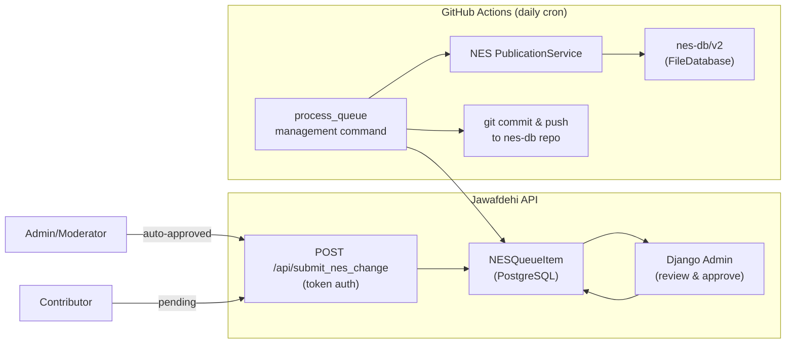

# NES Queue System

Replace the NES migration-based update approach with a queue-based API in the Jawafdehi API. Contributors submit entity update requests via a single authenticated endpoint, admins/moderators approve via Django admin (or auto-approve), and a daily GitHub Actions cron processes approved items by calling the NES [PublicationService](file:///Users/kwame/Documents/projects/newnepal/newnepal-meta/services/nes/nes/services/publication/service.py#34-681) and pushing changes to `nes-db`.

## Architecture



**Flow:**
1. **Submit** — Authenticated user POSTs to `/api/submit_nes_change` with an action and payload
2. **Auto-approve** — If the caller is Admin or Moderator, the item is immediately set to `APPROVED`
3. **Manual review** — Otherwise, item stays `PENDING` until reviewed in Django admin
4. **Process** — Daily GitHub Actions cron runs `process_queue`, which calls NES [PublicationService](file:///Users/kwame/Documents/projects/newnepal/newnepal-meta/services/nes/nes/services/publication/service.py#34-681) for each approved item
5. **Commit** — After processing, changes are committed and pushed to the `nes-db` repository

## High-Level Component Changes

| Component | Change | Files |
|-----------|--------|-------|
| **New `nesq` app** | New Django app with models, serializer, API view, admin, processor | `nesq/` (7 new files) |
| **Settings** | Register app, add token auth, add `NES_DB_PATH` env var | [config/settings.py](file:///Users/kwame/Documents/projects/newnepal/newnepal-meta/services/jawafdehi-api/config/settings.py) |
| **URL routing** | Add queue endpoint | [config/urls.py](file:///Users/kwame/Documents/projects/newnepal/newnepal-meta/services/jawafdehi-api/config/urls.py) |
| **Dependencies** | Add `djangorestframework` token auth (already included) | [pyproject.toml](file:///Users/kwame/Documents/projects/newnepal/newnepal-meta/services/nes/pyproject.toml) (no change needed) |
| **GitHub Actions** | Daily cron workflow | `.github/workflows/process-nes-queue.yml` |
| **Tests** | Comprehensive test suite for queue system | `tests/nesq/` |

---

## Proposed Changes

### New Django App: `nesq`

---

#### [NEW] [models.py](file:///Users/kwame/Documents/projects/newnepal/newnepal-meta/services/jawafdehi-api/nesq/models.py)

**`QueueAction`** (TextChoices):
- `CREATE_ENTITY` — Create a new NES entity
- `UPDATE_ENTITY` — Patch an existing NES entity's attributes
- `ADD_NAME` — Add an entity name or misspelled name

**`QueueStatus`** (TextChoices):
- `PENDING` — Awaiting admin review
- `APPROVED` — Approved, waiting for cron processing
- `REJECTED` — Rejected by admin
- `COMPLETED` — Successfully processed
- `FAILED` — Processing failed

**`NESQueueItem`** model:

| Field | Type | Description |
|-------|------|-------------|
| `action` | CharField (choices) | One of `QueueAction` |
| `payload` | JSONField | Action-specific data |
| `status` | CharField (choices) | One of `QueueStatus`, default `PENDING` |
| `submitted_by` | ForeignKey(User) | Authenticated user who submitted |
| `reviewed_by` | ForeignKey(User, null) | Admin who approved/rejected |
| `reviewed_at` | DateTimeField (null) | When review happened |
| `processed_at` | DateTimeField (null) | When cron processed it |
| `change_description` | TextField | Description of the change (from API caller) |
| `error_message` | TextField (blank) | Error details if processing failed |
| `result` | JSONField (null) | Result data from NES (e.g., created entity ID) |
| `created_at` | DateTimeField (auto_now_add) | Submission timestamp |
| `updated_at` | DateTimeField (auto_now) | Last update timestamp |

---

#### [NEW] [serializers.py](file:///Users/kwame/Documents/projects/newnepal/newnepal-meta/services/jawafdehi-api/nesq/serializers.py)

- **`NESQueueSubmitSerializer`** — Validates `action` and `payload`. Payload validation is action-specific.
- **`NESQueueItemSerializer`** — Read serializer for the response after submission.

---

#### [NEW] [api_views.py](file:///Users/kwame/Documents/projects/newnepal/newnepal-meta/services/jawafdehi-api/nesq/api_views.py)

Single endpoint:
- `POST /api/submit_nes_change` — Submit a queue item (token auth required)
  - If caller is Admin or Moderator → auto-set status to `APPROVED`
  - Otherwise → status stays `PENDING`

Uses DRF `TokenAuthentication` with `IsAuthenticated` permission.

---

#### [NEW] [admin.py](file:///Users/kwame/Documents/projects/newnepal/newnepal-meta/services/jawafdehi-api/nesq/admin.py)

Register `NESQueueItem` in Django admin:
- List display: action, status, submitted_by, reviewed_by, created_at
- List filters: status, action
- Admin actions: bulk approve, bulk reject
- Inline review (approve/reject with one click)

---

#### [NEW] [processor.py](file:///Users/kwame/Documents/projects/newnepal/newnepal-meta/services/jawafdehi-api/nesq/processor.py)

**`QueueProcessor`** class:
1. Query all `APPROVED` items ordered by `created_at`
2. Build the final `change_description` by appending the submitter's username: `"{item.change_description} (submitted by {item.submitted_by.username})"`
3. For each item, call the appropriate NES [PublicationService](file:///Users/kwame/Documents/projects/newnepal/newnepal-meta/services/nes/nes/services/publication/service.py#34-681) method with the augmented description:
   - `CREATE_ENTITY` → `publication.create_entity()`
   - `UPDATE_ENTITY` → `publication.update_entity()`
   - `ADD_NAME` → `publication.update_entity()` (appending to entity's names list)
4. On success: set status to `COMPLETED`, store result, set `processed_at`
5. On failure: set status to `FAILED`, store error message
6. After all items: `git add`, `git commit`, `git push` on the `nes-db` repo

> [!NOTE]
> NES [PublicationService](file:///Users/kwame/Documents/projects/newnepal/newnepal-meta/services/nes/nes/services/publication/service.py#34-681) is async. The processor uses `asyncio.run()` to bridge Django's sync context.

---

#### [NEW] [management/commands/process_queue.py](file:///Users/kwame/Documents/projects/newnepal/newnepal-meta/services/jawafdehi-api/nesq/management/commands/process_queue.py)

Management command invoked by GitHub Actions:
```bash
poetry run python manage.py process_queue
```

---

#### [NEW] [urls.py](file:///Users/kwame/Documents/projects/newnepal/newnepal-meta/services/jawafdehi-api/nesq/urls.py) / [apps.py](file:///Users/kwame/Documents/projects/newnepal/newnepal-meta/services/jawafdehi-api/nesq/apps.py)

Standard app config and URL registration.

---

### Existing File Changes

#### [MODIFY] [settings.py](file:///Users/kwame/Documents/projects/newnepal/newnepal-meta/services/jawafdehi-api/config/settings.py)

```diff
 INSTALLED_APPS = [
     ...
     "cases",
+    "rest_framework.authtoken",
+    "nesq",
 ]

+# NES Database Configuration
+NES_DB_PATH = os.getenv("NES_DB_PATH", str(BASE_DIR / "nes-db" / "v2"))
```

#### [MODIFY] [urls.py](file:///Users/kwame/Documents/projects/newnepal/newnepal-meta/services/jawafdehi-api/config/urls.py)

```diff
 urlpatterns = [
     ...
     path("api/", include("cases.urls")),
+    path("api/", include("nesq.urls")),
 ]
```

---

### GitHub Actions

#### [NEW] [process-nes-queue.yml](file:///Users/kwame/Documents/projects/newnepal/newnepal-meta/services/jawafdehi-api/.github/workflows/process-nes-queue.yml)

Daily cron workflow:
- Trigger: `schedule: cron: '0 0 * * *'` (midnight UTC daily)
- Steps: checkout repo, checkout `nes-db`, install dependencies, run `process_queue`, commit & push `nes-db` changes
- Requires: `NES_DB_PUSH_TOKEN` secret for pushing to `nes-db` repo

---

## Verification Plan

### Automated Tests

New test files in `tests/nesq/`:

| Test file | Covers |
|-----------|--------|
| `test_models.py` | Model creation, status transitions, field validation |
| `test_serializers.py` | Payload validation per action type |
| `test_api_views.py` | POST endpoint, auth, auto-approve for admin/mod |
| `test_processor.py` | Queue processing with mocked NES PublicationService |

```bash
cd services/jawafdehi-api
poetry run pytest tests/ -v
```
