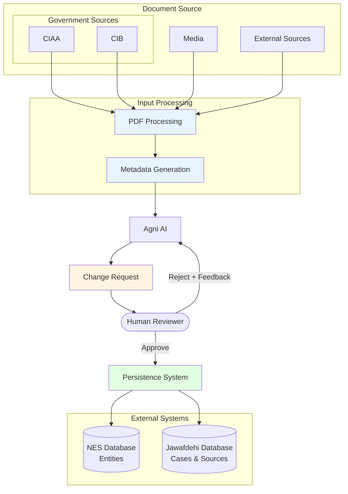

# Agni AI

Damodar Dahal
December 15, 2025

**Agni AI** is an AI-assisted data enrichment system designed to accelerate the creation of corruption cases for Jawafdehi by automatically extracting and structuring information from government documents. Named after the Sanskrit word for "fire" (अग्नि), it transforms raw documents into refined, structured data through intelligent processing and human-in-the-loop verification. Agni AI handles bilingual Nepali-English content, performs entity extraction and matching, and generates change requests that human reviewers can approve or refine through iterative feedback.

## Background

**Nepal Entity Service (NES)** is an open source, open data, and open API platform that provides a comprehensive database of Nepali public entities—including persons (politicians, public officials), organizations (political parties, government bodies), and locations (provinces, districts, municipalities). It features full versioning, relationship tracking, and native bilingual support for Nepali and English. NES serves as the foundational data layer for civic technology applications.

**Jawafdehi** (https://jawafdehi.org) is a civic tech platform built on top of NES that promotes transparency and accountability in Nepali governance. It maintains an open database of corruption cases and allegations of misconduct by public entities, helping citizens access critical information about accountability issues. Together, these platforms enable data-driven transparency and empower citizens to hold public figures and institutions accountable.

## Practical challenge

**The Real Problem:** It takes a long time to build corruption cases based on primary sources.

Building a single case from official government documents currently takes hours or days of manual work. We face three core challenges:

1. **Scraping text from government websites is difficult** - Government websites only support small bandwidth (slow downloads, frequent timeouts), have service availability issues (sites go down unpredictably, maintenance windows without notice), and contain Nepali text which is harder to perform OCR on (especially in scanned documents with poor quality).

2. **Our engineering team size is limited to perform manual data sourcing** - We don't have enough engineers to manually browse government portals, download documents, extract text, identify entities, and structure the data. The manual process doesn't scale with the volume of documents we need to process.

3. **Our content moderation and case worker team size is limited to perform fact checks** - We have a small team of domain experts who can verify source credibility, validate extracted information, cross-reference claims, and review cases before publication. Manual fact-checking creates a bottleneck that limits how many cases we can publish.

**Current workflow:** A researcher manually browses government websites → downloads PDFs → reads and understands the document → extracts relevant information → formats data to match our schema → cross-checks against existing database → creates/updates entities and cases → another person reviews for accuracy → finally publishes. This can take **hours per document**.

## Tenets

Core principles that must guide our solution design:

1. **Scalable** - Must handle 10,000+ cases and 100,000+ entities. Support concurrent processing, scale horizontally as volume increases, and work within infrastructure cost constraints.

2. **Incremental Processing** - Process documents one at a time or in small groups, allowing us to start small and scale up gradually. Each document should be independently processable without requiring the entire corpus.

3. **Integrity** - Data must be factual and traceable. No duplicate entities (e.g., "रामबहादुर श्रेष्ठ" and "Ram Bahadur Shrestha" should resolve to the same entity). No duplicate cases. Every piece of data must be traceable back to its source document with complete audit trails.

4. **Human-in-the-Loop** - AI-assisted but human-verified. The system should accelerate our small team's work, not replace it. Outputs must be easy to review and correct, with clear presentation of extracted data and proposed changes before they're committed to the database.

5. **Transparent and Auditable** - The system must explain its decisions. Show confidence scores for extractions, explain why entities were matched or created as new, flag uncertain extractions for review, and provide clear reasoning that helps reviewers focus their limited time on the right things.

## Solution

We scrape verified official documents from government websites and build a solution to update our entity/jawafdehi services using an AI-assisted, human-in-the-loop workflow.

### Workflow Architecture

The system follows a streamlined approach that emphasizes human review, iterative feedback, and clear separation of concerns:

### Detailed Workflow Steps

1. **Document Ingestion**
   - Source documents are collected from government websites (CIAA, CIB), media outlets, and external sources
   - Documents are typically in PDF format, often containing Nepali text and scanned images

2. **PDF Processing**
   - Extract text content from PDFs using OCR for scanned documents
   - Handle bilingual content (Nepali and English)
   - Preserve document structure and metadata

3. **Metadata Generation**
   - Generate semi-structured metadata describing the document
   - Include source information, document type, publication date
   - Add human-provided context to guide AI processing

4. **AI Analysis (Agni)**
   - Extract entities (persons, organizations, locations) from document text
   - Identify relationships between entities
   - Match extracted entities against existing NES database
   - Structure case information (allegations, timeline, evidence)
   - Generate confidence scores for all extractions

5. **Change Request Generation**
   - Create a structured change request with proposed modifications
   - Include:
     - New entities to create in NES
     - Existing entities to update
     - New cases to create in Jawafdehi
     - DocumentSource records to add
     - Relationships to establish
   - Provide explanations and confidence scores for each proposed change

6. **Human Review**
   - Present change request to human reviewer in clear, reviewable format
   - Reviewer can:
     - **Approve**: Accept all or selected changes
     - **Reject with Feedback**: Provide corrections and guidance
     - **Modify**: Edit proposed changes before approval
   - System highlights low-confidence extractions for focused review

7. **Iterative Refinement**
   - If rejected, AI receives feedback and regenerates change request
   - Process repeats until reviewer approves
   - Maintains conversation history for context

8. **Persistence**
   - Approved changes are committed to databases
   - Creates/updates entities in NES
   - Creates/updates cases and sources in Jawafdehi
   - Establishes relationships between entities
   - Maintains full audit trail of all changes

## Challenges

Building Agni AI presents several technical and operational challenges that must be addressed:

1. **Entity Resolution and Deduplication**
   - Matching entities across bilingual text (Nepali and English variations)
   - Handling name variations, aliases, and transliterations
   - Preventing duplicate entity creation when the same person/organization appears in multiple documents
   - Resolving ambiguous references (e.g., multiple people with similar names)

2. **Nepali Language Processing**
   - OCR accuracy for Nepali text in scanned documents
   - Handling mixed-script documents (Nepali and English)
   - Named entity recognition for Nepali language
   - Transliteration consistency between Devanagari and Latin scripts

3. **Document Quality and Variability**
   - Poor quality scans from government sources
   - Inconsistent document formats across different agencies
   - Missing or incomplete metadata
   - Handling tables, charts, and non-textual content

4. **AI Accuracy and Reliability**
   - Ensuring high precision to minimize reviewer burden
   - Providing meaningful confidence scores
   - Handling edge cases and ambiguous information
   - Managing AI costs at scale (token usage, API calls)

5. **Review Interface Design**
   - Presenting complex change requests in reviewable format
   - Enabling efficient review of large batches of changes
   - Maintaining context across iterative feedback loops

6. **Data Integrity and Versioning**
   - Handling concurrent processing of related documents
   - Ensuring referential integrity across NES and Jawafdehi databases
   - Managing version conflicts when updating existing entities

7. **Scalability and Performance**
   - Processing large PDF documents efficiently
   - Querying existing entity database for matching at scale
   - Managing state for long-running review processes
   - Handling batch processing of multiple documents

8. **Source Credibility and Verification**
   - Handling conflicting information across multiple sources
   - Tracking source reliability and credibility scores