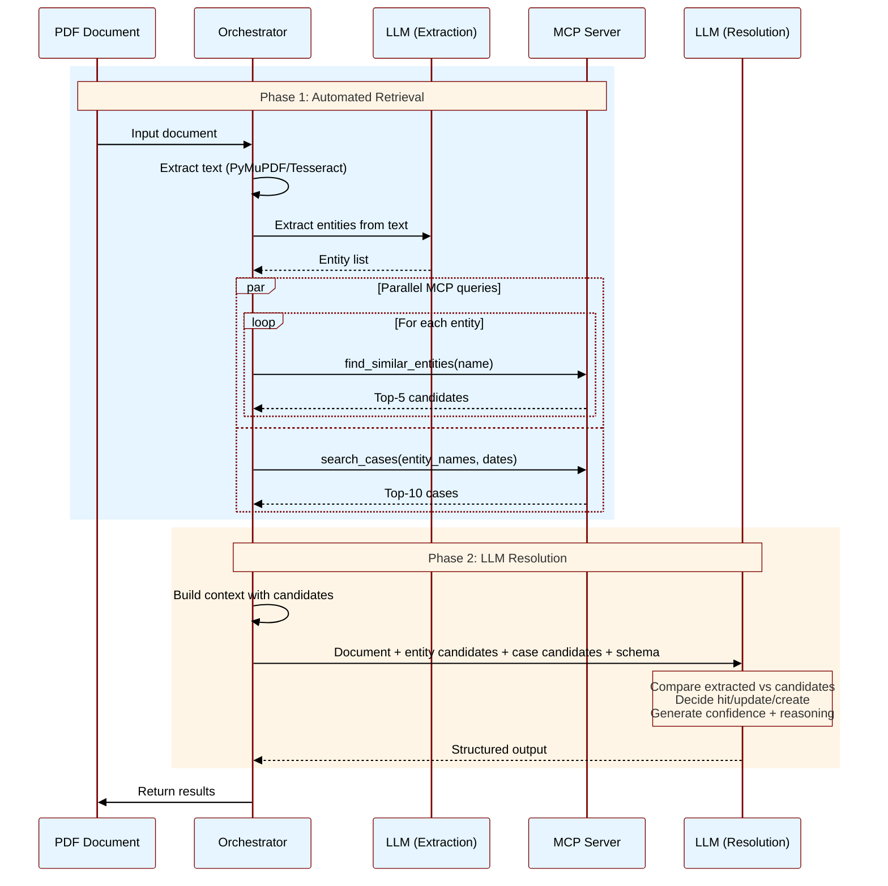
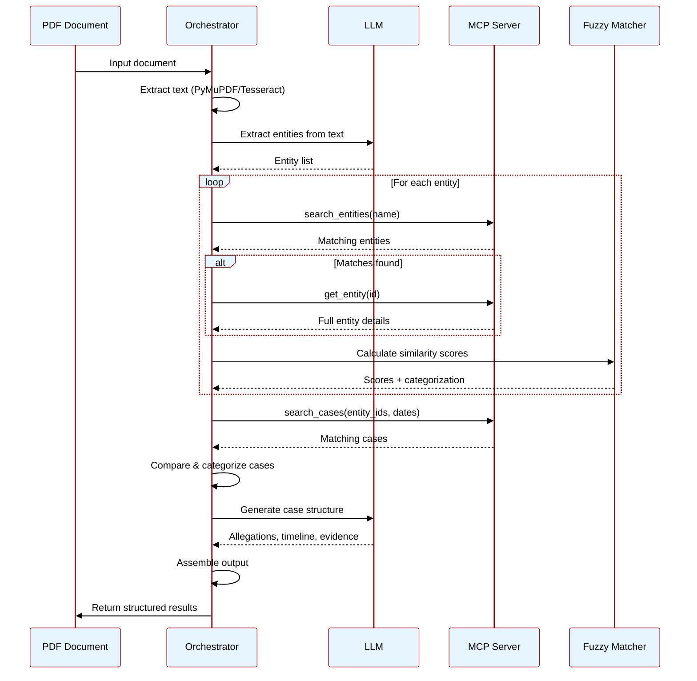
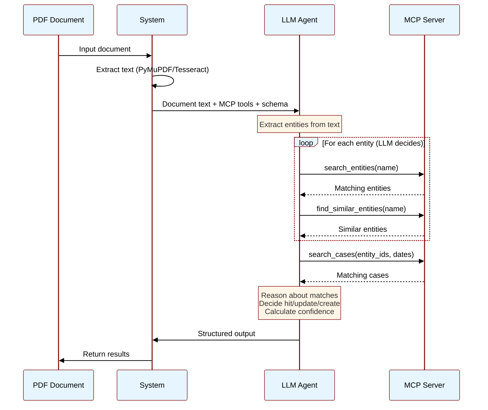

# Uranium Solution Approaches

## Solution Parameters

### Runtime Context

**Important**: The system has access to the complete NES entity database and Jawafdehi case database during runtime through an **MCP (Model Context Protocol) server**.

**Why MCP?**
- The full database is too large to fit in LLM context windows
- MCP provides tool-based access to query entities and cases on-demand
- LLM can search, filter, and retrieve specific entities without loading everything
- Enables efficient retrieval-based workflows (RAG patterns)

**MCP Server Capabilities**:
- `search_entities(query, entity_type, limit)` - Search for entities by name/attributes
- `get_entity(nes_id)` - Retrieve full entity details by ID
- `find_similar_entities(name, entity_type, threshold)` - Fuzzy matching for duplicates
- `search_cases(query, entity_ids, date_range)` - Search cases by criteria
- `get_case(case_id, version)` - Retrieve full case details

This architecture allows the LLM to iteratively query the database as needed during processing, rather than requiring all data upfront.

### Input Specification

The system accepts a batch of documents for processing:

```json
{
  "batch_id": "uuid",
  "documents": [
    {
      "document_id": "uuid",
      "file": "path/to/document.pdf",
      "metadata": {
        "source_url": "https://oag.gov.np/...",
        "source_type": "government_document",
        "publication_date": "2024-12-01",
        "issuing_authority": "Office of the Auditor General",
        "document_type": "audit_report",
        "language": "ne",
        "title": "वार्षिक लेखापरीक्षण प्रतिवेदन २०८०/८१"
      },
      "context": {
        "system_prompt": "This is an audit report identifying financial irregularities...",
        "expected_entities": ["organizations", "persons", "locations"],
        "case_type": "corruption"
      }
    }
  ]
}
```

**Input Components:**

1. **File(s)**: PDF documents or equivalent formats
2. **Metadata**: Semi-structured information about the source
   - Source URL and type
   - Publication details
   - Issuing authority
   - Document classification
   - Language identifier
3. **Context**: Human-provided guidance for AI processing
   - System prompt with domain context
   - Expected entity types to extract
   - Suggested case type

### Output Specification

The system produces a structured response showing all proposed changes:

```json
{
  "batch_id": "uuid",
  "status": "completed",
  "summary": {
    "entities_hit": 5,
    "entities_to_update": 3,
    "entities_to_create": 2,
    "cases_hit": 1,
    "cases_to_update": 1,
    "cases_to_create": 1
  },
  "results": [
    {
      "document_id": "uuid",
      
      "entities": {
        "hit": [
          {
            "nes_id": "person_123",
            "name": "रामबहादुर श्रेष्ठ",
            "confidence": 0.95
          }
        ],
        
        "to_update": [
          {
            "nes_id": "person_456",
            "name": "सीता देवी",
            "changes": {
              "positions": [{"title": "प्रमुख", "organization": "org_789", "start_date": "2020-01-15"}]
            },
            "confidence": 0.87,
            "reasoning": "Document mentions 'प्रमुख सीता देवी' in organization context"
          }
        ],
        
        "to_create": [
          {
            "type": "person",
            "data": {
              "name": {"ne": "हरि प्रसाद पौडेल", "en": "Hari Prasad Poudel"},
              "positions": [{"title": "सचिव", "organization": "org_101"}]
            },
            "confidence": 0.78,
            "reasoning": "New person, appears as 'सचिव हरि प्रसाद पौडेल'",
            "potential_duplicates": [
              {"nes_id": "person_999", "name": "हरि पौडेल", "similarity": 0.72}
            ]
          }
        ]
      },
      
      "cases": {
        "hit": [
          {
            "case_id": "case_abc",
            "title": "अनियमित खर्च मामला",
            "confidence": 0.91
          }
        ],
        
        "to_update": [
          {
            "case_id": "case_abc",
            "changes": {
              "evidence": [{"description": "Audit report confirms irregular expenditure", "source_id": "source_123"}],
              "timeline": [{"date": "2023-08-15", "event": "Audit investigation initiated"}]
            },
            "confidence": 0.89,
            "reasoning": "Document provides additional evidence"
          }
        ],
        
        "to_create": [
          {
            "data": {
              "title": {"ne": "स्वास्थ्य सामग्री खरिदमा अनियमितता", "en": "Health Equipment Procurement Irregularities"},
              "case_type": "corruption",
              "date_range": ["2022-03-01", "2023-06-30"],
              "entities": ["person_456", "org_789"],
              "allegations": ["No tender process", "40% overpricing", "No delivery verification"]
            },
            "confidence": 0.82,
            "reasoning": "Distinct case with clear allegations and timeline"
          }
        ]
      }
    }
  ]
}
```

### Key Output Components

**1. Hit** - Existing matches found in database (>0.90 confidence), no changes needed

**2. To Update** - Existing records needing new information with proposed changes

**3. To Create** - New records not found in database, with duplicate warnings if applicable

**Confidence Scores:**
- **0.90-1.0**: Very high (exact matches, strong evidence)
- **0.80-0.89**: High (good matches, supporting evidence)
- **0.70-0.79**: Medium (reasonable match, some ambiguity)
- **<0.70**: Low (needs human review)

Each change includes confidence score, reasoning, and evidence from the document.

---

## Solution Approaches

We present three alternative architectural approaches for implementing the Uranium system, each with different tradeoffs.

### Approach A: Hybrid - Orchestrated Retrieval + LLM Reasoning

**Overview**: Combine orchestrated MCP queries (for efficiency) with LLM reasoning (for accuracy) in a two-phase approach.

**How it works**:
1. **Phase 1: Automated Retrieval**
   - Extract text from PDF
   - LLM extracts entities from text
   - Orchestration layer calls MCP to retrieve candidates:
     - `find_similar_entities()` for each extracted entity (top-5 matches)
     - `search_cases()` with entity names and date range (top-10 cases)
   
2. **Phase 2: LLM Resolution**
   - Single LLM call with:
     - Document text
     - Extracted entities with their candidate matches
     - Retrieved cases
     - Instructions to categorize and explain
   - LLM reasons about each entity/case:
     - Compares extracted vs. candidates
     - Decides hit/update/create
     - Generates confidence scores with reasoning
     - Produces final structured output

**Pros**:
- Best of both worlds: efficient retrieval + smart reasoning
- Predictable MCP costs (fixed number of queries)
- High accuracy (LLM sees relevant candidates)
- LLM can explain decisions naturally
- Handles ambiguous cases well

**Cons**:
- Two-phase complexity
- Requires careful prompt engineering for Phase 2
- May retrieve irrelevant candidates (wasted context)
- Still requires multiple components

**Best for**: Production systems prioritizing accuracy, when you need explainable decisions, balanced cost/performance requirements



---

### Approach B: Orchestrated Pipeline with MCP Queries

**Overview**: Break processing into discrete stages with explicit orchestration logic, using MCP for targeted database queries at each stage.

**How it works**:
1. **Document Ingestion**: PyMuPDF/Tesseract extracts text, calculates quality score
2. **Entity Extraction**: LLM identifies entities from text (names, roles, dates)
3. **Entity Resolution**: For each extracted entity:
   - Call `search_entities(name)` via MCP
   - If matches found, call `get_entity(id)` for full details
   - Use fuzzy matching algorithm to calculate similarity scores
   - Categorize as hit/update/create based on thresholds
4. **Case Matching**: 
   - Call `search_cases()` with matched entity IDs and date range
   - Compare document content against retrieved cases
   - Categorize as hit/update/create
5. **Case Structure Generation**: LLM generates allegations, timeline, evidence from text
6. **Output Assembly**: Combine all results into final output format

**Pros**:
- Predictable flow and cost (controlled MCP calls)
- Modular - each component can be optimized independently
- Easier to debug (inspect output at each stage)
- Better control over matching logic (can tune thresholds)
- Can use specialized models (embeddings for matching, LLM for extraction)

**Cons**:
- More complex architecture
- More code to maintain
- Less flexible than LLM-driven approach
- Requires careful orchestration logic

**Best for**: Production systems requiring reliability, predictable costs, and debuggability



---

### Approach C: LLM-Driven with MCP Tool Calls

**Overview**: Give the LLM direct access to the database via MCP tools and let it orchestrate the entire extraction and matching process.

**How it works**:
1. Extract text from PDF
2. Single LLM call with:
   - Document text
   - MCP tools for database access
   - JSON schema for output format
   - Few-shot examples showing tool usage
3. LLM iteratively:
   - Extracts entities from document
   - Calls `search_entities()` and `find_similar_entities()` to check for matches
   - Calls `search_cases()` to find related cases
   - Decides hit/update/create based on retrieved data
   - Produces final structured output with confidence scores

**Pros**:
- LLM has full autonomy to query as needed
- Natural reasoning about matches and confidence
- Flexible - LLM can adapt strategy per document
- Simpler codebase (less orchestration logic)

**Cons**:
- Unpredictable number of tool calls (cost varies)
- Harder to optimize (LLM controls flow)
- May miss entities if LLM doesn't search thoroughly
- Requires LLM with good tool-calling capabilities

**Best for**: Exploratory phase, complex documents requiring adaptive strategies, when LLM reasoning quality is critical



---

## Recommended Approach

**Start with Approach A (Hybrid)** for the following reasons:

1. **Best accuracy**: LLM reasoning with relevant candidates produces high-quality matches
2. **Predictable costs**: Fixed retrieval phase, single LLM call for resolution
3. **Explainable**: LLM naturally generates reasoning for confidence scores
4. **Debuggable**: Can inspect retrieved candidates and LLM decisions separately
5. **Aligns with tenets**: Transparent decisions, scalable, supports incremental processing

**Implementation order**:
1. **Build MCP server first**: Implement database access tools (`search_entities`, `find_similar_entities`, `search_cases`, `get_entity`, `get_case`)
2. **Test MCP tools**: Verify retrieval quality and performance
3. **Build Phase 1**: Orchestration layer for extraction and retrieval
4. **Build Phase 2**: LLM resolution with prompt engineering
5. **Iterate**: Tune retrieval parameters and prompts based on results

**Migration path**: 
- If accuracy is sufficient with simpler logic, simplify to Approach B (remove LLM reasoning)
- If LLM reasoning is excellent, experiment with Approach A (full LLM autonomy)
- Can mix approaches per document type (simple docs → B, complex docs → C)

---

## Comparison

This section compares the three approaches against our core tenets and practical requirements.

### Tenet Alignment

| Tenet | Approach A (Hybrid) | Approach B (Orchestrated) | Approach C (LLM-Driven) |
|-------|------------------------|---------------------------|---------------------|
| **Scalable** | ✅ **Best** - Fixed retrieval phase + single LLM call. Predictable costs with high quality. | ✅ **Good** - Fixed pipeline stages with predictable resource usage. Easy to optimize bottlenecks. | ⚠️ **Moderate** - Unpredictable MCP calls make cost scaling uncertain. LLM may make redundant queries. |
| **Incremental Processing** | ✅ **Excellent** - Two-phase design handles documents independently. Can batch retrieval if needed. | ✅ **Excellent** - Pipeline processes documents one at a time. Modular stages. | ✅ **Excellent** - Each document processed independently. LLM adapts per document. |
| **Integrity** | ✅ **Best** - Retrieval finds candidates, LLM reasons about matches. Combines algorithmic precision with contextual understanding. | ✅ **Good** - Explicit fuzzy matching and deduplication logic. Tunable thresholds. | ⚠️ **Moderate** - Depends on LLM thoroughness. May miss duplicates if search strategy is incomplete. |
| **Human-in-the-Loop** | ✅ **Best** - LLM sees candidates and explains decisions. Clear reasoning for reviewers. | ⚠️ **Moderate** - Requires explicit confidence calculation. Less natural explanations. | ✅ **Good** - LLM naturally generates explanations. Confidence scores from reasoning. |
| **Transparent & Auditable** | ✅ **Best** - Retrieved candidates + LLM reasoning = full transparency. Easy to debug both phases. | ⚠️ **Moderate** - Algorithmic decisions less intuitive. Requires explicit logging. | ✅ **Good** - LLM can explain decisions. Tool call logs show search process. |

### Technical Comparison

| Dimension | Approach A (Hybrid) | Approach B (Orchestrated) | Approach C (LLM-Driven) |
|-----------|-----------|-----------|-----------|
| **Complexity** | Medium (two phases) | High (multiple components) | Low (simple orchestration) |
| **Cost Predictability** | High (fixed retrieval + single LLM) | High (fixed pipeline) | Low (variable tool calls) |
| **Accuracy** | Highest (retrieval + reasoning) | Medium (algorithmic matching) | High (LLM reasoning) |
| **Debuggability** | High (inspect both phases) | High (inspect each stage) | Medium (inspect tool calls) |
| **Optimization** | Medium (tune retrieval + prompts) | Easy (tune each component) | Hard (LLM controls flow) |
| **Latency** | Predictable (two phases) | Predictable (pipeline stages) | Variable (depends on LLM queries) |
| **LLM Requirements** | Extraction + reasoning capability | Basic extraction capability | Strong tool-calling capability |

### Practical Considerations

**Approach A: Hybrid**
- **When to use**: Production systems requiring both accuracy and cost control (recommended)
- **Risks**: Two-phase complexity, requires careful prompt engineering for resolution phase
- **Team fit**: Balanced - moderate engineering effort, leverages LLM strengths efficiently

**Approach B: Orchestrated Pipeline**
- **When to use**: Production systems with predictable document types, when cost control is critical
- **Risks**: May miss nuanced matches that LLM would catch, requires more engineering effort
- **Team fit**: Requires more engineering capacity to build and maintain pipeline components

**Approach C: LLM-Driven**
- **When to use**: Exploratory phase, highly variable document types, when LLM quality is paramount
- **Risks**: Cost overruns from excessive tool calls, incomplete entity searches, hard to optimize
- **Team fit**: Good for small team (less code to maintain), but requires careful prompt engineering

### Cost Analysis

Assuming 1,000 documents/month, average 20 pages each:

| Cost Component | Approach A | Approach B | Approach C |
|----------------|-----------|-----------|-----------|
| **MCP Queries** | ~50-200 per doc (variable) | ~20-30 per doc (fixed) | ~15-25 per doc (fixed) |
| **LLM Calls** | 1 large call with tools | 3-4 focused calls | 2 calls (extraction + resolution) |
| **Token Usage** | High (full doc + tool results) | Medium (focused extractions) | Medium-High (doc + candidates) |
| **Estimated Monthly** | $800-2,000 (variable) | $400-600 (predictable) | $500-800 (predictable) |

*Note: Costs are estimates and depend on LLM provider, model choice, and document complexity.*

### Recommendation Summary

**Start with Approach C** because it:
1. ✅ Aligns best with all five tenets
2. ✅ Balances accuracy (LLM reasoning) with cost predictability (fixed retrieval)
3. ✅ Provides transparency (candidates + reasoning) for human reviewers
4. ✅ Scales efficiently (predictable resource usage)
5. ✅ Fits our small team (moderate complexity, high quality output)

**Evolution path**:
- **Phase 1**: Build Approach C with basic retrieval and LLM resolution
- **Phase 2**: Optimize retrieval parameters based on accuracy metrics
- **Phase 3**: Consider simplifying to Approach B if LLM reasoning isn't adding value
- **Phase 4**: Experiment with Approach A for complex documents if needed
