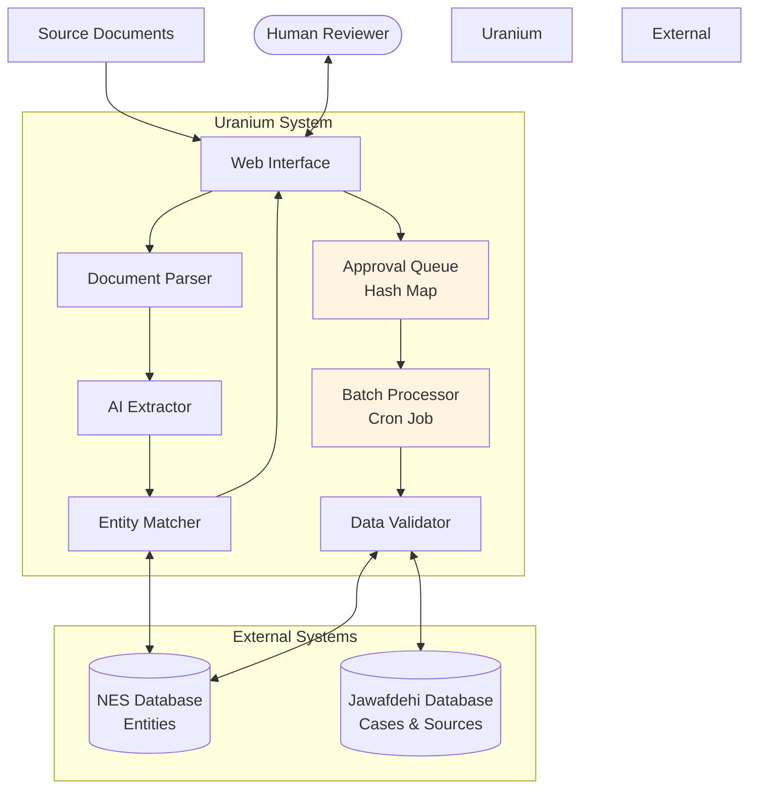
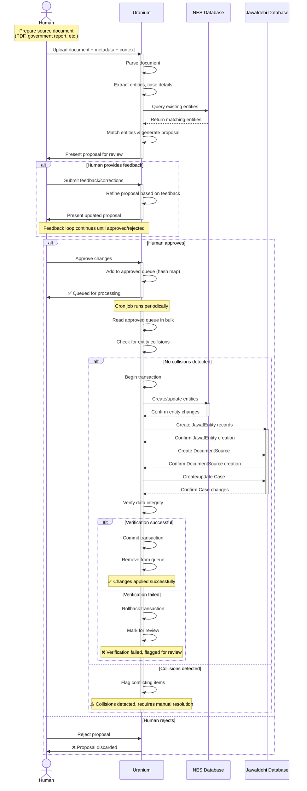

# Uranium: Simplified AI-Assisted Data Enrichment Workflow

## Overview

This document outlines a streamlined approach to AI-assisted data enrichment for Jawafdehi and NES. The workflow emphasizes human-in-the-loop review, iterative feedback, and clear separation of concerns.

## Component Diagram

## Workflow Diagram

