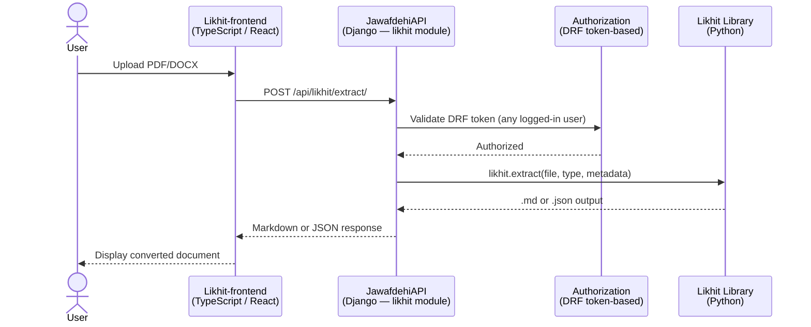

# Likhit – Nepali Official Document Converter

**Project Code:** Likhit (लिखित)
**Status:** Design Phase

---


## Overview

Likhit is a tool for converting Nepali official documents — PDFs and scanned publications — into structured Markdown files. It features both a **web interface** (Likhit-frontend) and a **command-line interface (CLI)**, making it accessible to non-technical contributors as well as developers. The goal is to make content in CIAA press releases, Kanun Patrika issues, court rulings, and similar publications machine-readable and indexable for downstream platforms like Jawafdehi and NGM.

The name *लिखित* (likhit) means "written" or "documented" in Nepali, reflecting the project's mission: turning opaque, locked-away documents into open, structured text.

---

## Architecture

Likhit is composed of three services that work together:

> **Design principle:** `likhit` should be **thin**. It must minimize its own dependencies so that JawafdehiAPI can import it without pulling in large or conflicting packages. Heavy optional dependencies (e.g. OCR engines, alternative PDF backends) should be extras, not hard requirements.

- **Likhit** (`github.com/NewNepal-org/likhit`) — Python library + CLI, standalone repository. Handles all document parsing and conversion locally using font-based text extraction. Can be used directly from the command line by developers or data contributors, or called as a Python library by the API.
- **JawafdehiAPI** (Django) — imports Likhit as a Python dependency and wraps it in a new `likhit` Django module. Exposes a `POST /api/likhit/extract/` endpoint. Accessible to **any logged-in Jawafdehi user** via DRF token-based authentication.
- **Likhit-frontend** (`github.com/NewNepal-org/likhit-frontend`) — TypeScript / React frontend that calls the JawafdehiAPI endpoint. Lets users upload or link to a document, preview the converted Markdown, and attach the output directly to a Jawafdehi case as an evidence source.



---

## CLI Usage

Likhit is primarily invoked as a command-line tool. The primary subcommand is `extract`.

```bash
# Basic usage
likhit extract --type=ciaa-press-release file.pdf --out file.md

# With metadata flags
likhit extract \
  --type=kanun-patrika \
  --year=2081 \
  --volume=12 \
  file.pdf \
  --out kanun-patrika-2081-12.md

# Extract only specific pages
likhit extract --type=ciaa-press-release --pages=1-3 file.pdf --out file.md

# Extract a specific table (by index, 0-based)
likhit extract --type=ciaa-press-release --extract-table=0 file.pdf --out table.json
```

### Arguments & Flags (SUBJECT TO CHANGE)

| Flag | Required | Description |
|---|---|---|
| `--type` | Yes | Document type (e.g. `ciaa-press-release`, `kanun-patrika`, `supreme-court-order`, `gazette-notice`) |
| `--out` | Yes | Output file path (`.md` or `.json`) |
| `--title` | No | Override document title in frontmatter |
| `--date` | No | Publication date (`YYYY-MM-DD`) — written into frontmatter |
| `--source-url` | No | Original URL of the document — written into frontmatter |
| `--pages` | No | Extract only a page range, e.g. `1-3` or `5` |
| `--extract-table` | No | Extract a single table by index (0-based); output is always `.json` |
| `INPUT` | Yes | Path to the input PDF or DOCX file |

All provided flags are written into the output alongside auto-detected metadata.

---

## Output Format

Pass `--out file.md` for Markdown output or `--out file.json` for JSON output. The output format is **extensible** — new output types (e.g. plain text, structured HTML) can be added by implementing additional renderers without changing the extraction pipeline.

**Markdown** — full document text with YAML frontmatter:
```markdown
---
title: "..."
doc_type: ciaa_press_release
source_url: "..."
publication_date: "YYYY-MM-DD"
likhit_version: "0.1.0"
---

# Document heading

Body text...
```

**JSON** — structured representation of the same content:
```json
{
  "title": "...",
  "source_url": "...",
  "doc_type": "ciaa_press_release",
  "publication_date": "YYYY-MM-DD",
  "likhit_version": "0.1.0",
  "sections": [
    { "heading": "...", "body": "..." }
  ]
}
```

## Repository Requirements

### Unit Tests

All modules must have unit tests written with `pytest`. Tests cover extraction logic, structure recognition, and Markdown/JSON rendering in isolation using mocked or synthetic inputs.

### Integration Tests

The repository will include a `samples/` directory containing real-world sample PDFs and DOCX files (one per supported document type). Integration tests run the full pipeline end-to-end against these samples and assert that the output matches expected fixtures. These tests serve as regression guards — if a parsing change breaks a known document, CI catches it.

```
samples/
├── ciaa_press_release_sample.pdf
├── kanun_patrika_sample.pdf
└── supreme_court_order_sample.pdf
```

### Linting & Formatting

Likhit follows the same formatting standards as JawafdehiAPI, using a `scripts/format.sh`:

```bash
# Format
poetry run black .
poetry run ruff check --fix .

# Check only (for CI)
poetry run black --check .
poetry run ruff check .
```

### CI Workflows

GitHub Actions workflows (`.github/workflows/`) will run on every pull request and push to `main`:

- **`ci.yml`** — runs unit tests, integration tests, and lint check
- Mirrors the CI setup used in other Jawafdehi projects

---

## MVP Scope

For the initial release, Likhit will target:

1. **CIAA press releases** — full text extraction from typeset PDFs
2. **Tables from CIAA annual reports** — table extraction via `--extract-table`, output as JSON
3. **Kanun Patrika full text** — complete text extraction from typeset PDFs

Let's focus on the CIAA press release first, since it is easy to parse. Then we can work on the tables and Kanun Patrika.

---

- [ ] Determine font mapping strategy for pre-Unicode and custom Devanagari fonts in older PDFs

